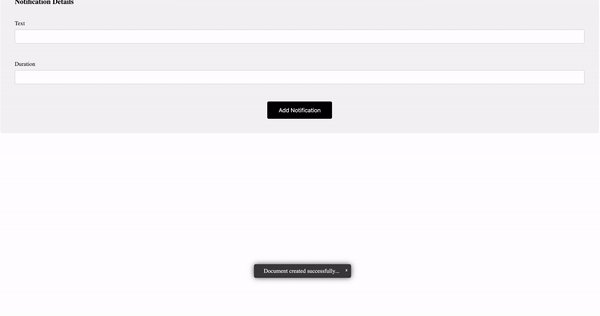

# react-notification
React toast notification component

## steps to execute
  1. Install nodejs and npm if not already installed on you machine.
  2. run command "npm install". This will install/download all the dependencies mentioned in package.json file.
  2. run command "npm run build" to build the project.
  3. open index.html in a browser.

## points to be noted.
  1. I have already added few notifications while creating the store. extra notifications can be added through the form.

#Demo

